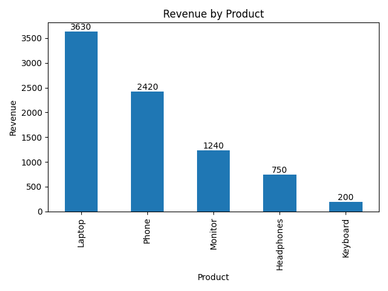
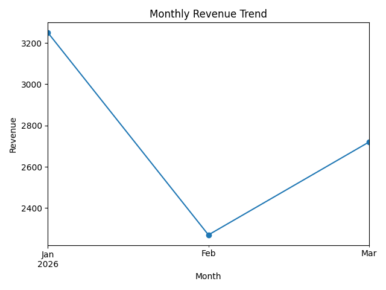

# E-Commerce Sales ETL & Analytics Pipeline

## Project Overview

This project builds a Python-based e-commerce sales pipeline that processes monthly CSV files, validates data quality, combines valid records, generates business KPIs, and exports reporting datasets.

The pipeline includes schema validation, numeric validation, business-rule checks, error handling, PASS/FAIL pipeline logging, and automated reporting.

## Technologies Used

- Python
- Pandas
- NumPy
- Matplotlib
- OpenPyXL
- Jupyter Notebook

## Project Structure

```text
ecommerce-sales-analysis/
│
├── input/
│   ├── january_sales.csv
│   ├── february_sales.csv
│   └── march_sales.csv
│
├── test_data/
│   └── bad_sales.csv
│
├── output/
│   ├── combined_sales.csv
│   └── sales_pipeline_output.xlsx
│
├── ecommerce_sales_pipeline.ipynb
├── product_revenue_chart.png
├── monthly_revenue_trend.png
└── README.md
```

## Pipeline Workflow

1. Discover monthly sales CSV files
2. Load files using Pandas
3. Validate required columns
4. Validate numeric fields
5. Check Quantity, Price, and Revenue business rules
6. Verify Revenue = Quantity × Price
7. Reject invalid files
8. Record PASS/FAIL pipeline logs
9. Combine validated monthly datasets
10. Calculate business KPIs
11. Generate monthly and product-level summaries
12. Export CSV and Excel reports

## Key Business Results

- **Total Revenue:** $8,240
- **Total Orders:** 10
- **Average Order Value:** $824
- **Top Product:** Laptop
- **Top Customer:** David
- **Best Revenue Month:** January
- **Laptop Revenue Contribution:** Approximately 44%

## Product Revenue Analysis



Laptop generated the highest revenue at **$3,630**, followed by Phone at **$2,420**.

## Monthly Revenue Trend



Revenue was highest in January at **$3,250**, decreased to **$2,270** in February, and recovered to **$2,720** in March.

## Data Quality Validation

The pipeline validates:

- Missing required columns
- Invalid numeric values
- Quantity less than or equal to zero
- Price less than or equal to zero
- Revenue less than or equal to zero
- Revenue calculation mismatches

A deliberately corrupted sales file was created to test the validation process.

The test file contained a negative price, which also caused a revenue calculation mismatch. The pipeline detected the errors, marked the file as **FAIL**, and prevented it from entering the final combined dataset.

## Output Files

The pipeline generates:

- `output/combined_sales.csv` — validated and consolidated sales data
- `output/sales_pipeline_output.xlsx` — multi-sheet Excel report containing:
  - Summary
  - Monthly Summary
  - Product Performance
  - Combined Sales
  - Pipeline Log

## Skills Demonstrated

- Python data processing
- Pandas data manipulation
- ETL pipeline development
- Data quality validation
- Error handling
- Business-rule validation
- Multi-file ingestion
- Data aggregation
- KPI reporting
- Excel reporting
- Data visualization
